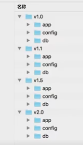
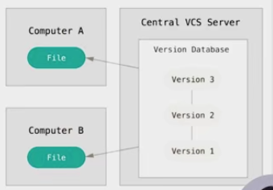
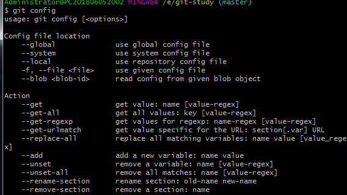

[git官方文档链接](https://git-scm.com/book/zh/v2)  
[玩转Git三剑客链接](https://time.geekbang.org/search?q=%E7%8E%A9%E8%BD%ACgit%E4%B8%89%E5%89%91%E5%AE%A2)
#  table of contents
* [版本管理的演变](#版本管理的演变)
    * [VCS出现前](#VCS出现前)  
    * [集中式VCS](#集中式VCS)  
    * [分布式VCS](#分布式VCS)  
    * [Git的特点](#Git的特点)  
    * [内容与顺序](#内容与顺序)
* [Git安装](#Git安装)  
* [使用Git之前需要做的最小配置](#使用Git之前需要做的最小配置)  
    * [最小配置](#最小配置)  
    * [config的三个作用域](#config的三个作用域)
* [创建第一个仓库并配置local用户信息](#创建第一个仓库并配置local用户信息)  
## 版本管理的演变
### VCS出现前
- 用目录拷贝区别不同版本
- 公共文件容易被覆盖
- 成员沟通成本很高，代码集成效率低下  

### 集中式VCS
- 有集中的版本管理服务器
- 具备文件版本管理和分支管理能力
- 集成效率有明显提高
- 客户端必须时刻和服务器相连  

### 分布式VCS
- 服务端和客户端都有完整的版本库
- 脱离服务端，客户端照样可以管理版本
- 查看历史和版本比较等多数操作，都不需要访问服务器，比集中式VCS更能提高版本管理效率
### Git的特点
- 最优的存储能力
- 非凡的性能
- 开源的
- 很容易做到备份
- 支持离线操作
- 很容易定制工作流程
### 内容与顺序
- git
- GitHub  
全球最大的开源社区，优秀的开源项目，GitHub开发代码管理，代码评审，项目管理相关的功能以外，提供代码存储，持续交互，持续集成的环境
- GitLab  
有社区版本，开源,有自带CEI机制，和GitHub不一样(什么是CEI？)  
## Git安装
 [Git官网安装链接](https://git-scm.com/book/zh/v2/%E8%B5%B7%E6%AD%A5-%E5%AE%89%E8%A3%85-Git)
## 使用Git之前需要做的最小配置  
### 最小配置
 - 配置user.name和user.email  
   
 global有什么作用？  
 缺省等同于local  
 - $git config --local (local只对某个仓库有效)  
 - $git config --global(global对当前用户所有仓库有效)  
 - $git config --system (system对系统所有登录的用户有效)  
 显示config的配置，加--list  
 - $git config --list --local  
 - $git config --list --global  
 - $git config --list --system  
 pwd(当前工作路径)  
 git config(查看现有的设备中已经配了哪些东西，什么都不输入的情况下，提示命令有哪些参数)  
   
## 创建第一个仓库并配置local用户信息  
### 建Git仓库
两种场景：  
1.把已有的项目代码纳入Git管理  
- $cd 项目代码所在的文件夹  
- $git init  
2.新建的项目直接用Git管理  
- $cd 某个文件夹  
- $git init your_project #会在当前路径下创建和项目名称同名的·文件夹  
- $cd your_project
